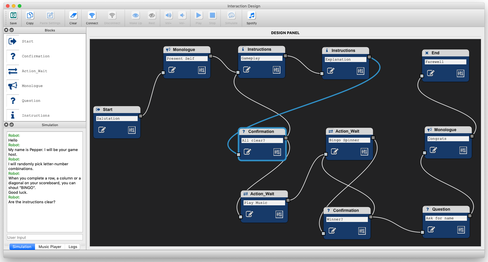

# Interaction-Design Tool for Multi-Modal Robot Communication

This project provides a prototyping tool for designing interactions with social robots. The current version of the tool requires Python3 and is compatible with the [Pepper and NAO Robots](https://www.ald.softbankrobotics.com/en/robots/pepper). Interacting with the robots can be via the qi framework (Python2) or the [Interactive-Robotics](https://www.interactive-robotics.com) cloud (Python3). 

The tool was successfully tested on ***MAC*** and ***Linux*** (it should also work on ***Windows***).

## Requirements

To use the tool you need to do the following:

#### **A.** Clone the repository (e.g., in the Documents folder).

`$ cd ~/Documents`

`$ git clone https://github.com/ES-TUDelft/interaction-design-tool-ir.git`

#### **B.** Install the requirements 

Follow the instructions in [Section I](#i-installation-guide)

#### **C.** Run the following script to load the tablet app on Pepper:
  
  `$ cd ~/Documents/interaction-design-tool-ir`
  
  `$ ./scripts/update_app.sh`
  
#### **D.** Launch the user interface and robot workers as follows:

`$ cd ~/Documents/interaction-design-tool-ir`

`$ python3 main_tool.py`

  - Click "**Connect**" to the robot and enter the settings (e.g., name and realm or IP) then run:
  
    * ***Option 1***: using the interactive-robotics cloud (requires Python 3 and robot realm)

      `$ python3 main_robot.py`
      
      `$ python3 main_engagement.py`
     
    * ***Option 2***: using qi framework (requires Python 2 and robot IP)
    
      `$ python2 main_qi_robot.py`
      
      `$ python2 main_qi_engagement.py`

  * ***Note***: This repository is being updated on a regular basis. Use ***git pull*** to integrate the latest changes.

  

---

## Content

**I.** [Installation Guide](#i-installation-guide)

**II.** [Setting up Spotify](#ii-setting-up-spotify)

**III.** [User Manual](#iii-user-manual)

**IV.** [Citation](#iv-citation)

---

## I. Installation Guide

Follow the instructions for [LINUX](https://github.com/ES-TUDelft/interaction-design-tool-ir/blob/master/docs/installation/linux.md) or [MAC](https://github.com/ES-TUDelft/interaction-design-tool-ir/blob/master/docs/installation/mac.md)

---

## II. Setting up Spotify

* Follow the instructions in the [setup Spotify document](https://github.com/ES-TUDelft/interaction-design-tool-ir/blob/master/docs/installation/spotify.md)

* Once you're connected to **Spotify**, you'll be able to see your playlists and tracks.

* To play a song (e.g., using the test button or the mini-player panel in the main interface), you will need an active device (i.e., a Spotify Player) that is running on either your browser or PC/Phone.

* ***NOTE:*** When the player is not able to start a song, it means the device is not active. Just refresh your Spotify Player browser or the desktop app. 

* (DISABLED in the current version) When playing music, you can set the robot to do some animations as follows:
  
  * Make one (or more) list of animations using the default ones available for the [Pepper robot](http://doc.aldebaran.com/2-5/naoqi/motion/alanimationplayer-advanced.html#pepp-pepper-list-of-animations-available-by-default).
  
  * Add your list of animations to [/interaction_manager/properties/animations.yaml](https://github.com/ES-TUDelft/interaction-design-tool-ir/blob/master/interaction_manager/properties/animations.yaml).
  
  * Create a music action (i.e., using the Action block) and enable the "animation" check box in the edit panel. 

---

## III. User Manual

**TODO**

---

## IV. Citation

Please cite our work when you use this tool in your studies:

 * Elie Saad, Joost Broekens and Mark A. Neerincx (2020): An Iterative Interaction-Design Method for Multi-Modal Robot Communication. In *Proceedings of the IEEE International Conference on Robot and Human Interactive Communication (RO-MAN)*, pp. 690-697, IEEE.

       @InProceedings{Saad2020,
         author    = {Elie Saad and Joost Broekens and Mark A. Neerincx},
         booktitle = {IEEE International Conference on Robot and Human Interactive Communication (RO-MAN)},
         title     = {An Iterative Interaction-Design Method for Multi-Modal Robot Communication},
         year      = {2020},
         pages     = {690--697},
         publisher = {IEEE},
       }
