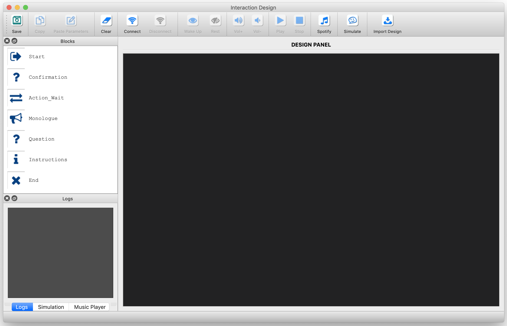

# INSTALLATION GUIDE
---
In this document we go over the installation of the required libraries and setting up Spotify for successfully running the prototyping tool.

**A.** Clone the repository (e.g., to your Documents):

`$ cd Documents`

`$ git clone https://github.com/ES-TUDelft/robot-interaction-tool.git`

==> if you don't have git, install it from: https://git-scm.com/downloads

**B.** Run the following script to load the tablet app on Pepper:

`$ cd ~/Documents/robot-interaction-tool`

`$ ./update_app.sh`

   * Note that when running the script, you will be asked for the Pepper's IP address as well as your PC's and Pepper's passwords.

**C.** Proceed with the installation guide depending on your PC's OS.

---

## Content
**I.** [Linux Installation Guide](#i-linux-installation-guide)

**II.** [Windows Installation Guide](#ii-windows-installation-guide)

**III.** [MAC Installation Guide](#iii-mac-installation-guide)

**IV.** [Setting up Spotify](#iv-setting-up-spotify)

**V.** [Known Installation Issues](#v-known-installation-issues)

---

# I. Linux Installation guide

## 1. Install the requirements

* Follow the steps found in this document: [/docs/installation/linux.md](https://github.com/ES-TUDelft/robot-interaction-tool/blob/master/docs/installation/linux.md)

## 2. Launch the Interaction Tool

Once you finish installing all the requirements, open a terminal and cd to where you saved the tool:

`$ cd robot-interaction-tool`

`$ python main.py`

The user interface should run now, good luck!

  

---

# II. Windows Installation guide

## 1. Install the requirements

* Follow the steps found in this document: [/docs/installation/win.md](https://github.com/ES-TUDelft/robot-interaction-tool/blob/master/docs/installation/win.md)

## 2. Launch the Interaction Tool

Once you finish installing all the requirements, open a command prompt and follow the same steps as **Section I.2** above.

---

## III. MAC Installation Guide

## 1. Install the requirements

* Follow the steps found in this document: [/docs/installation/mac.md](https://github.com/ES-TUDelft/robot-interaction-tool/blob/master/docs/installation/mac.md)

## 2. Launch the Interaction Tool

Once you finish installing all the requirements, open a terminal and follow the same steps as **Section I.2** above.

---

## IV. Setting up Spotify

* Go to https://developer.spotify.com/dashboard/login (create an account or login to yours)

* Click on "Create a Client ID" and fill in the required fields (e.g., RobotInteractionTool for the app name)

* Click on the app you just created and go to "Edit Settings". In the ***Redirect URIs*** field add http://localhost:8080/callback/ and click on ***SAVE*** (bottom left).

* Copy the app's the ***Client ID*** and ***Client Secret*** to the ***config.yaml*** file in "robot-interaction-tool/interaction_manager/properties" OR in this properties directory, create a new file named ***spotify.yaml*** and add the following:

        spotify:
            username: YOUR_USER_NAME
            client_id: YOUR_CLIENT_ID
            client_secret: YOUR_CLIENT_SECRET
            redirect_uri: http://localhost:8080/callback/
            
* The ***username*** from the previous step is your personal **Spotify** username (found in your profile: https://www.spotify.com/).

* To connect to the spotify web api ***for the first time***, you'll need a running server listening to 8080 port. You can use the server.js provided by this repository (you need to install node.js first: https://nodejs.org/en/download/) or create your own.

`$ cd ~/Documents/robot-interaction-tool`

`$ node es_common/server.js`

* Now, you have two options, depending on the OS:

   * **Windows** platforms: open a command prompt and do (only when connecting for the first time; otherwise use the Spotify button in the tool):
   
   `$ python interaction_manager\utils\spotify_winconfig.py`
   
   * **Other** platforms (e.g., Linux and Mac): either do (in a terminal) *"$ python interaction_manager/utils/spotify_winconfig.py"* or launch the interaction tool GUI (as in Sec. I-8) and click on the "Spotify" button (in the toolbar).

* You'll be presented with a connection dialog. You can either use the default settings (that you previously put in the config.yam or spotify.yaml) or enter new ones.

* Click on the ***Connect*** button. 

        * If this is the first time you connect to Spotify (i.e., there is no cache), you will be redirected to a web browser.
        * Just *copy the URL* shown on the webpage and *paste* it in the terminal running the tool then press Enter.
        * The URL should be similar to this but longer (DO NOT USE IT, it is just an example):
            - http://localhost:8080/callback/?code=BtmyiHfVlKvGtO4mgwYJQKKOUWEeNTRm22CXrAnTRp...

* If it's successful, you'll see your playlists and tracks. Click "OK" to save the setup (if you're using the tool).

* To play a song (e.g., using the test button or the mini-player panel in the main interface), you will need an active device (i.e., a Spotify Player) that is running on either your browser or PC/Phone.

* ***NOTE:*** When the player is not able to start a song, it means the device is not active. Just refresh your Spotify Player browser or the desktop app.

---

# V. Known Installation Issues: 

## a. ImportError: libQt5Widgets.so.5 not found!

This means that your newly installed library is not in the system path (i.e., it may be in the local usr path). 

You have to do it manually by adding two lines to local.conf as such (note that adding the path to local lib should suffice, but you can add path to qt513 to be sure):

==> I’m assuming you installed qt513 at: /opt/qt513:

* OPTION A): do it using echo

`$ echo “/usr/local/lib\n/opt/qt513/lib” > /etc/ld.so.conf.d/local.conf`

`$ sudo ldconfig`
   
* OPTION B): create a new file and add two lines to it as such:

`$ sudo vim /etc/ld.so.conf.d/local.conf`

`/usr/local/lib`

`/opt/qt513/lib`

*(P.S.: to exit vim and save the changes do: ESC :wq!)*

`$ sudo ldconfig`

* Now that you added the path to the newly created library, try to import PyQt5 again:

`$ python`

`>>> import PyQt5`

==> This should not return any errors. If it does, try step III.b!

## b. Qt not found!

If you experience issues related to Qt, try the following:

* Download Qt 5.13.2 for linux from: https://download.qt.io/official_releases/qt/5.13/5.13.2/ 
* Open a terminal:

`$ cd ~/Downloads`

`$ chmod +x qt-opensource-linux-x64-5.13.2.run`

`$ ./qt-opensource-linux-x64-5.13.2.run`

## c. Spotify integration

* ***If you experience issues with Spotipy*** (python library for the Spotify web api), uninstall the pip version then install it from the source as follows:

`$ pip uninstall spotipy`

`$ git clone https://github.com/plamere/spotipy.git`

`$ cd spotipy`

`$ python setup.py install`
