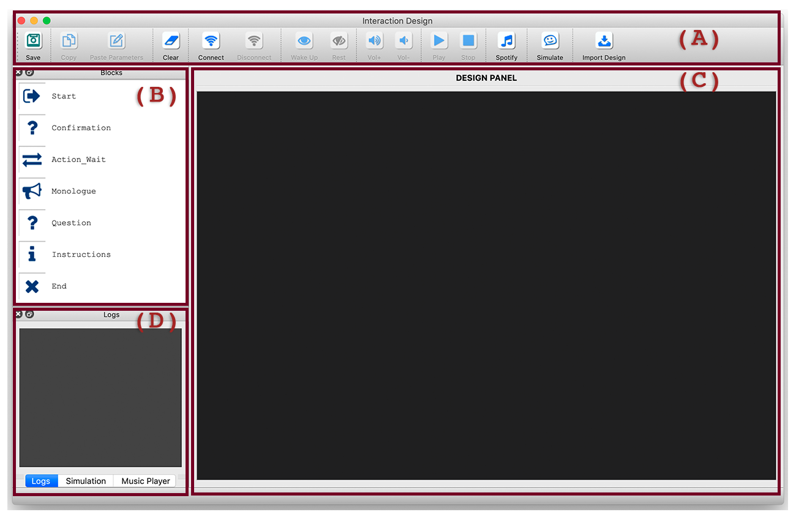
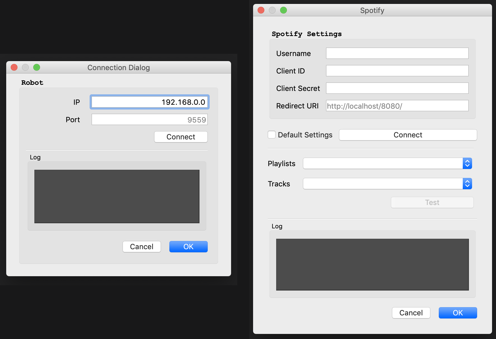
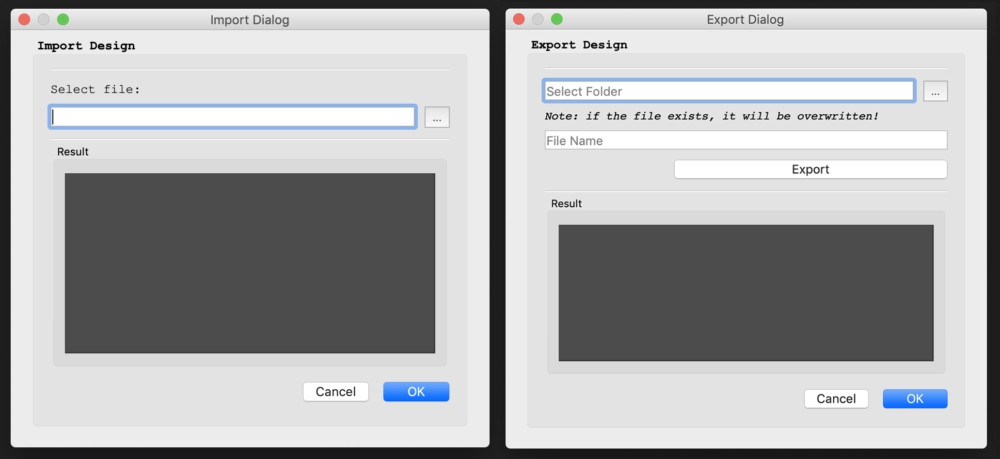
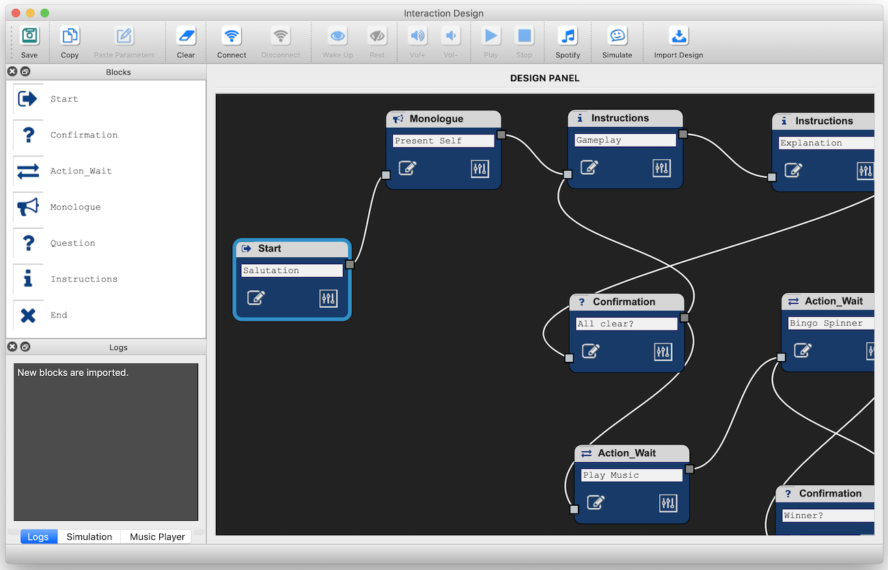
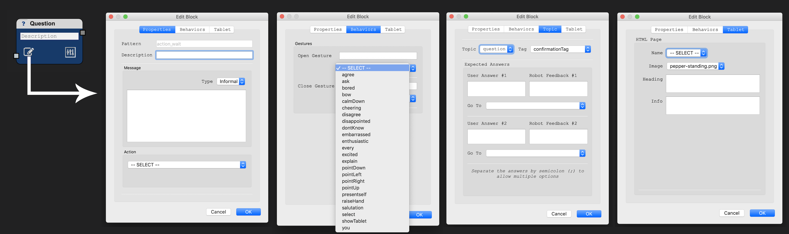
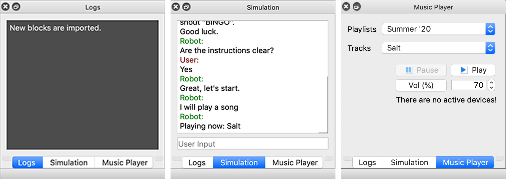

# Design Tool for Prototyping Human-Robot Communication
# - User Manual -

---

In this document we will go through each part of the prototyping tool’s main user interface and explain its components.

  
  
  <em>Figure 1: Preview of the user Interface for prototyping interactive dialogues with social robots. (A) the top menu bar; (B) list of available dialogue blocks; (C) design panel for building the dialogue flow; (E) panel for displaying the logs, the simulation progress and the music player controls.</em>

---

## Content

**1.** [Top Menu Bar](#1-top-menu-bar)

**2.** [Keyboard Shortcuts](#2-keyboard-shortcuts)

**3.** [Interaction Blocks Panel](#3-interaction-blocks-panel)

**4.** [Design Panel](#4-design-panel)
  
  * **4.1** [Block Properties](#41-block-properties)
  
  * **4.2** [Block Parameters](#42-block-parameters)

**5.** [Simulation and Music Dock](#5-simulation-and-music-dock)

---

## 1. Top Menu Bar

The top menu bar (Fig. 1.A) contains the following buttons, from left-to-right:

* **Save**: for saving the designs;
* **Copy**: copies the selected design block;
* **Paste Parameters**: pastes the design parameters to the selected block;
* **Clear**: deletes all blocks and clears the scene;
* **Connect**: opens a dialog GUI for connecting to the robot (Fig 2-Left);
* **Disconnect**: disconnects from the robot;
* **Wake Up**: to wake the robot up;
* **Rest**: to put the robot to rest;
* **Vol+** and **Vol-**: to increase or decrease the volume of the robot’s speakers;
* **Play**: to play the design and interact with the robot;
* **Stop**: to stop the current interaction;
* **Spotify**: opens a dialog GUI to connect to Spotify (music) web service (Fig. 2-Right);
* **Simulate**: to simulate the interaction (without being connected to a physical robot);
* **Import Design**: similar to **Export Design** (in the File menu), it opens a dialog GUI to import/export design blocks (Fig. 3).

  
  
  <em>Figure 2: Dialog GUI for managing the connection to the robot (left) and the connection to Spotify web service (right).</em>

  
  
  <em>Figure 3: Dialog GUIs for importing (left) and exporting (right) designs.</em>

## 2. Keyboard Shortcuts

Here’s a list of useful keyboard shortcuts:

* **Ctrl+Z**: Undo;
* **Shift+Ctrl+Z**: Redo;
* **Ctrl+C**: Copy;
* **Ctrl+V**: Paste;
* **Del**: Delete selected;
* **Shift+Ctrl+Del**: Clear scene (delete all);
* **Ctrl+S**: Save design.

## 3. Interaction Blocks Panel

The blocks panel (Fig. 1.B) contains the list of available blocks that the user can drag to the design panel when building an interactive dialogue with the robot.

## 4. Design Panel

The design panel (Fig. 1.C) is the space for designing the whole interaction. The blocks (1.3) are dropped in this panel and can be connected to one another with edges. Users can click on a block socket (i.e., starting point of the edge) and click again on a socket from another block (i.e., end point of the edge), as illustrated in 4. Users can also edit the properties and parameters of the blocks, which we will discuss in the following.

  
  
  <em>Figure 4: Design space with connected interaction blocks.</em>

### 4.1. Block Properties

When the user clicks on a block’s edit icon (Fig. 5), an dialogue GUI appears for setting the blocks properties such as the robot’s message, action, behaviors, dialogue flow (i.e., topic) and screen display.

  
  
  <em>Figure 5: Dialog GUI for editing the properties of the selected block. From left to right: tab for setting the robot message (i.e., speech act) and action (if any); tab for setting the robot’s gestures; tab for setting the dialogue topic (if the block pattern contains one, e.g., question pattern); tab for setting the robot tablet (i.e., screen) properties.</em>

### 4.2. Block Parameters
When the user clicks on a block’s parameter icon (Fig. 6), a dialogue GUI appears for setting the blocks parameters which are useful for designing expressive robot behaviors. Each parameter can be adjusted and tuned to reflect a given trait as follows:

  * Close gestures reflect a colder interaction whereas open gestures denote a warmer and more welcoming interaction (e.g., Nguyen et al. [1]);
  
  * A fixated gaze reflects a warmer and more attentive interaction compared to a diverted gaze, i.e., short and frequent (e.g., Kendon [2]);

  * Close proxemics denote a more personalized and intimate interaction compared to far proxemics, i.e., lead to a more distant interaction (e.g., Hall [3]);

  * A robot with a high pitch voice is found to be more attractive than a low-monotone voice (e.g., Niculescu et al. [4]), however, it all depends on the personal preferences and contextual factors;

  * Speech rate (i.e., speed) can be slow or fast, depending on the communication pace;

  * Speech acts have an effect on people's perception toward the robot (e.g., Zafari et al. [5]) and can be informal (i.e., motivational speech) or formal;

  * Eye color can also be used to induce feelings of relaxation (happiness) or tension, as validated by Terada et al. [6] (i.e., anger-red, trust-green, surprise-red and sadness-blue).

When connected to a physical robot, the user can test the parameter settings (i.e., by clicking on the ’Test’ button). The user can also apply the settings to the selected block (i.e., by clicking on the apply button) or to all blocks in the scene (i.e., by clicking on the apply all).

  
  
  <em>Figure 6: Dialog GUI for modifying the parameters of the selected block. From left to right: tab for setting the type of the robot’s gestures, gaze, and proxemics; tab for setting the robot’s voice (i.e., pitch, speed and prosody); and tab for setting the robot’s eye color.</em>

## 5. Simulation and Music Dock
The bottom left panel (Fig. 1-D) of the user interface is composed of three tabs.  The first tab  displays the system logs (Fig. 7-Left). The second tab is active when the simulator is launched (Fig. 7-Middle). The third tab contains a player for manually controlling the music (Fig. 7-Right).

  
  
  <em>Figure 7: Panel for displaying the system logs (left); the simulator (middle); and the music player (right).</em>

---

## REFERENCES

[1] T.-H. D. Nguyen, E. Carstensdottir, N. Ngo, M. S. El-Nasr, M. Gray, D. Isaacowitz, and D. Desteno, "Modeling warmth and competence in virtual characters". In Intelligent Virtual Agents, W.-P. Brinkman, J. Broekens, and D. Heylen, Eds. Cham: Springer International Publishing, 2015, pp. 167-180.

[2] A. Kendon and M. Cook, "The consistency of gaze patterns in social inter-action," British journal of psychology (London, England : 1953), vol. 60, pp. 481-94, December 1969.

[3] E. T. Hall, The Hidden Dimension. Garden City, N.Y.: Doubleday, 1966, ch. X: Distances in Man, pp. 113-129.

[4] A. Niculescu, B. Van Dijk, A. Nijholt, H. Li, and S. L. See, "Making social robots more attractive: The effects of voice pitch, humor and empathy," International Journal of Social Robotics, vol. 5, no. 2, pp. 171-191, Apr 2013.

[5] S. Zafari, I. Schwaninger, M. Hirschmanner, C. Schmidbauer, A. Weiss, and S. T. Koeszegi, "you are doing so great!" - the effect of a robot's interaction style on self-effcacy in hri," in 2019 28th IEEE International Conference on Robot and Human Interactive Communication (RO-MAN), Oct 2019, pp. 1-7.

[6] K. Terada, A. Yamauchi, and A. Ito, "Artifcial emotion expression for a robot by dynamic color change," in 2012 IEEE RO-MAN: The 21st IEEE International Symposium on Robot and Human Interactive Communication, Sep. 2012, pp. 314-321.
